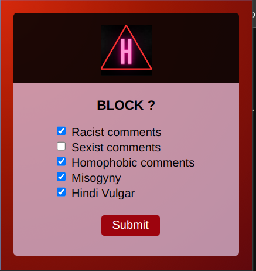
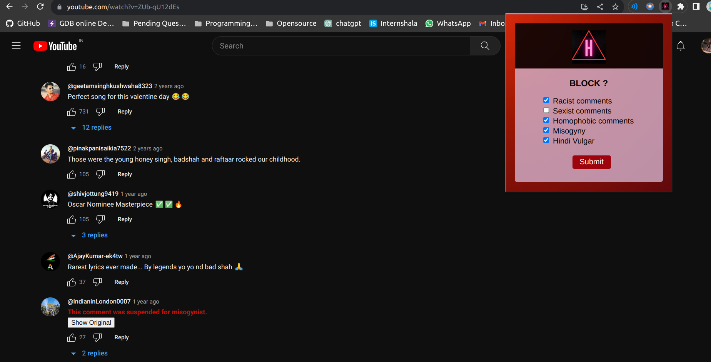
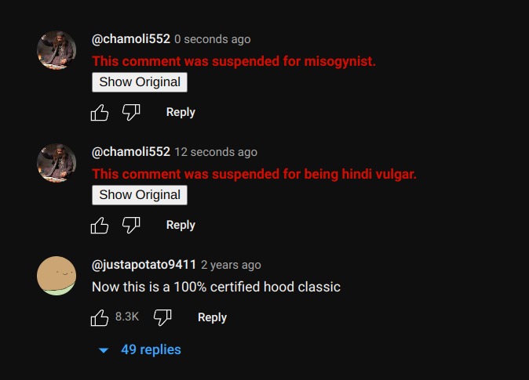
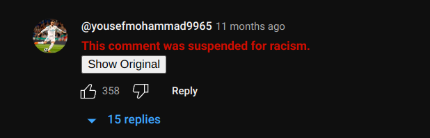
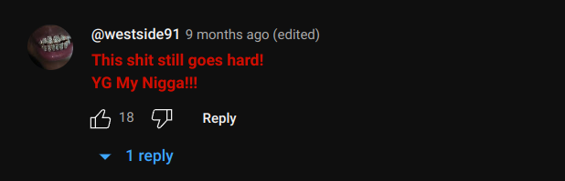

# Hate Speech Detector

## Overview
Introducing a Chrome extension designed to combat prevalent forms of online harassment, particularly targeting:

1. Misogyny
2. Racism
3. Homophobia
4. Sexism
5. Cyberbullying

This extension is dedicated to promoting a more respectful and inclusive online environment, with a primary focus on addressing these issues within YouTube's comment section.

## Why This Extension?
In the vast realm of YouTube, where countless voices converge to build communities, there's a dark side to the comments section. It's a breeding ground for anonymous users to spew hateful and harmful messages effortlessly. These comments serve no purpose other than to incite anger and sadness, devoid of any constructive critique.

Content creators face a barrage of degrading and mentally distressing comments on their videos, while the community witnesses negativity and offense on their favorite content. As avid consumers of online media, we believe it's imperative to wield a tool that battles these comments, making YouTube a safer haven for all.

## How to Use This Extension
1. Clone or download this repository into a folder
2. Go to [chrome://extensions/](chrome://extensions/)
3. Check the box "Developer mode"
4. Click "Load unpacked extension..." and select the folder
5. Select the `manifest.json` file.
6. Run the extension and go on any YouTube video.

## Tech Stack Used
- HTML
- CSS
- JavaScript
- API

## Images

## Author
Made by Chamoli 
